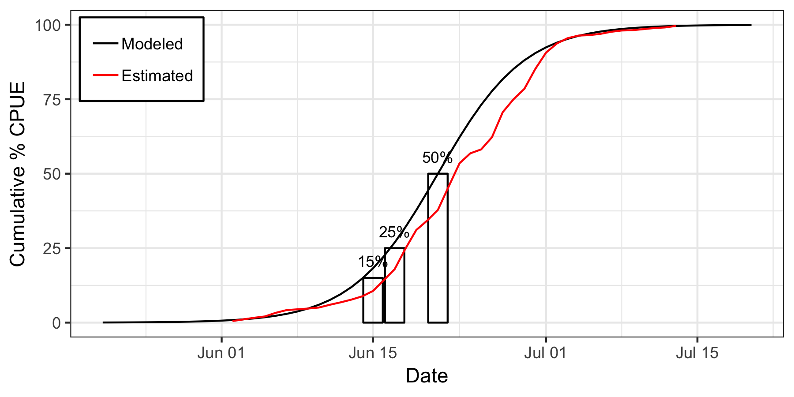
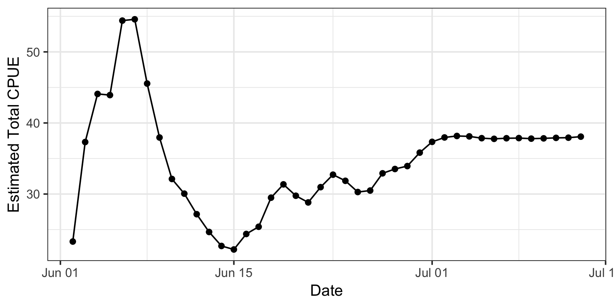

# 2019-yukon-forecasting

Data, code, and output for the 2019 operational forecast of Yukon River Chinook salmon run timing.

```{r, echo=FALSE, message=FALSE}
library(knitr)
library(readr)
predictions <- suppressWarnings({read_csv("may_forecast/predictions.csv")})
predictions$percentile <- c("15%", "25%", "50%")
```


## Forecasted Timing of Percentiles of Cumulative CPUE
```{r, echo=FALSE}
kable(predictions, col.names = c("Percentile", "Predicted Date (Day of June)"))
```

### Latest Daily Forecast



- **Black line:** Logistic curve fit to the three predicted percentiles of cumulative CPUE. This is our cumulative %CPUE model.
- **Red line:** Estimated cumulative %CPUE. This assumes the cumulative %CPUE model (black line) is correct and also assumes that, for example, if the cumulative CPUE at the 25% point is 10, then the end-of-season cumulative CPUE will be 40 (10/0.25). Cumulative %CPUE is then calculated from the daily cumulative CPUEs with 40 as the denominator. Daily CPUE values are from the LYTF set index.
- **How to read the graph:** If the timing forecast and the above %CPUE model are correct, we would expect the red line to match the black line. If the timing forecast is wrong, we would expect substantial deviation between the red and black lines, though there is no hard cutoff for this.

### Final CPUE Heuristic



- **Black, dotted line:** These are the final CPUE estimates we've made each day of the run.
- **How to read the graph:** When the timing model is correct, we expect the time series of Final CPUE estimates to stabilize and oscillate around a value. When the timing model is appreciably wrong, the time series will not stabilize.

## Previous years

- https://github.com/amoeba/2018-yukon-forecasting
- https://github.com/amoeba/2017-yukon-forecasting
- https://github.com/amoeba/2016-yukon-forecasting